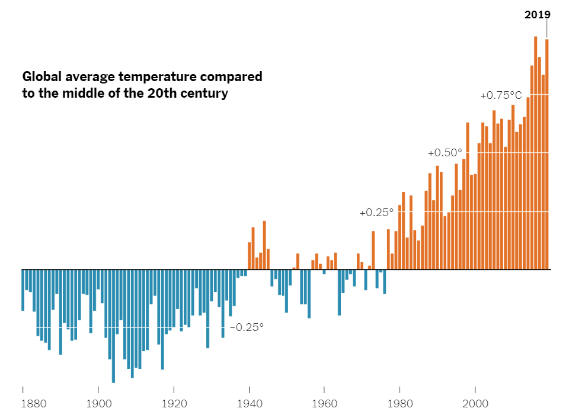

# **An overview of the context**

Bangladesh is exceptionally vulnerable to the adverse effects of climate change. 
Due to over-exploitation of natural resources and burring of fossil fuel, the atmospheric composition of earth is changing and creating a greenhouse effect. 
Mean global temperature has risen more than 1.5 °C since the pre-industrial era. As the temperature continues to rise, it will create adverse climatic conditions such as sea level rise, higher temperatures, enhanced monsoon precipitation, and an increase in cyclone intensity, especially in countries with low elevations like Bangladesh. 

Intended outcomes: 
The analysis will show the link between the rise in annual temperature with the changing rainfall intensity. It will also explore the changing temperature trends in different regions and visualize the adverse climatic events like heavy rainfall in Bangladesh.

## Target for visualization

•	Exploratory data analysis to find patterns and relationships in data.

•	Graphs to visualize rainfall intensity and relative humidity of Bangladesh from 1949 to 2013.

•	Graphs to visualize temperature variations in different regions of Bangladesh from 1949 to 2013.

•	Changing temperature trends in Bangladesh.

•	Interactive graphs to link increased rainfall intensity with rising temperature.

## Data file

1. Data used for this study is listed here. [https://www.kaggle.com/somesh24/sea-level-change](	https://www.kaggle.com/somesh24/sea-level-change)

2. [https://www.kaggle.com/vageeshabudanur/riseintemp-dataset](	https://www.kaggle.com/vageeshabudanur/riseintemp-dataset )

3. [https://www.kaggle.com/redikod/historical-rainfall-data-in-bangladesh ](https://www.kaggle.com/redikod/historical-rainfall-data-in-bangladesh)

4. [https://www.kaggle.com/yakinrubaiat/bangladesh-weather-dataset](	https://www.kaggle.com/yakinrubaiat/bangladesh-weather-dataset)

### [Global Temperature Change](https://www.nytimes.com/2020/04/23/learning/whats-going-on-in-this-graph-global-temperature-change.html)

